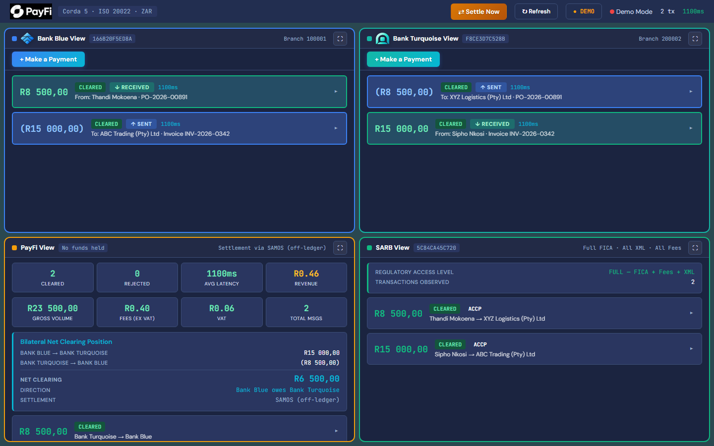
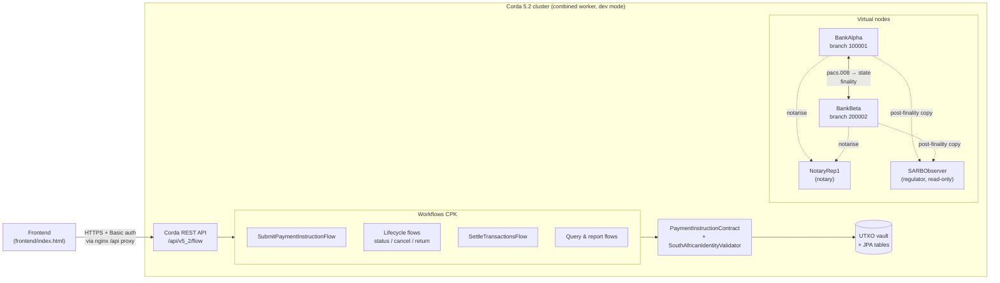
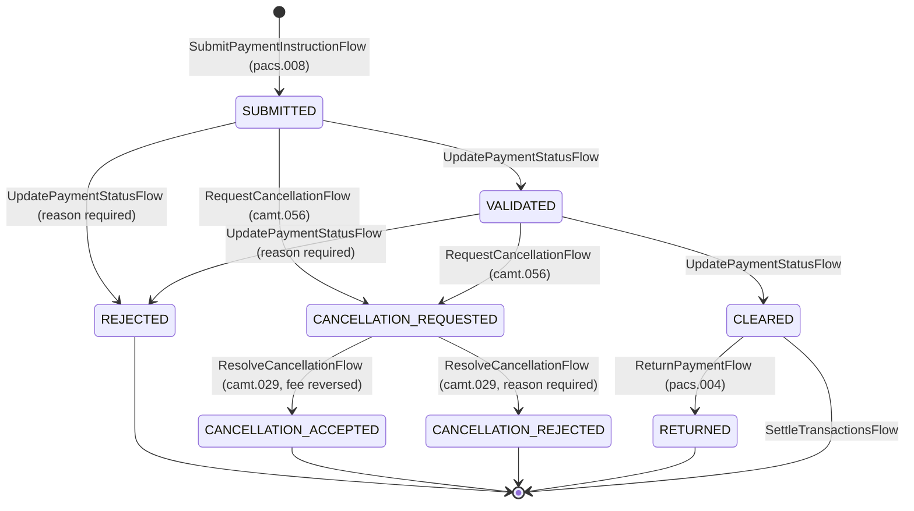

# PayFi DLT Bank Clearing

**ISO 20022 interbank ZAR clearing for South African digital banks, built on Corda 5.2.**

[](https://docs.r3.com/en/platform/corda/5.2.html)
[](https://kotlinlang.org/)
[](https://www.iso20022.org/)
[](LICENSE)

> **Status: pilot.** This is a working proof of concept on a dev-mode Corda network with demo data only. It is not production software. See [Pilot limitations](#pilot-limitations).



---

## What it does

PayFi is a distributed-ledger clearing layer for interbank EFT credits between South African digital banks:

1. A participant bank submits an **ISO 20022 `pacs.008.001.08`** (FI-to-FI customer credit transfer), either a single transaction or a batch.
2. The CorDapp parses it, applies **FICA** sender-identification and SA clearing rules, calculates the transaction fee, and records each transaction as a `PaymentInstructionState`. The state is signed by the debtor and creditor banks and notarised.
3. The submitting bank gets back an **ISO 20022 `pacs.002.001.10`** status report (`ACCP` or `RJCT` with reason code).
4. A **SARB observer node** gets a copy of every finalised transaction. It is not a signer and not a state participant, so regulatory visibility doesn't put the regulator in the transaction path.
5. At the end of the clearing window, banks run net settlement. This archives the on-ledger states, and the SARB observer marks its records as settled.

## Architecture



| Node | X.500 organisation | Role |
|---|---|---|
| BankAlpha | `O=BankAlpha, L=Johannesburg, C=ZA` | Participant bank (branch code `100001`) |
| BankBeta | `O=BankBeta, L=Cape Town, C=ZA` | Participant bank (branch code `200002`) |
| SARBObserver | `O=SARB, L=Pretoria, C=ZA` | Regulator observer. Stores every transaction in `sarb_transaction_records` |
| NotaryRep1 | `O=R3, L=London, C=GB` | Notary service |

The network is defined in [`config/static-network-config.json`](config/static-network-config.json).

## Payment lifecycle

The states below are the `PaymentStatus` values in [`PaymentInstructionState.kt`](contracts/src/main/kotlin/za/co/payfi/clearing/states/PaymentInstructionState.kt). `PaymentInstructionContract` enforces the transitions.



> `SettleTransactionsFlow` (contract command `Settle`) consumes **every** unconsumed state in the bank's vault, whatever its status, and so closes the clearing window. Business fields are immutable across all transitions; only `status` and `statusReason` may change.

## Features

All flows live in [`workflows/src/main/kotlin/za/co/payfi/clearing/flows/`](workflows/src/main/kotlin/za/co/payfi/clearing/flows/) and are started through the Corda REST API.

| Capability | Flow | Notes |
|---|---|---|
| Submit payment | `SubmitPaymentInstructionFlow` | Takes pacs.008 XML (single or batch) and returns pacs.002. Duplicate instructions are detected (message ID + instruction ID). Rejects payments from suspended participants |
| Status update | `UpdatePaymentStatusFlow` | `SUBMITTED → VALIDATED → CLEARED`, or `REJECTED` |
| Cancellation request | `RequestCancellationFlow` | camt.056 semantics |
| Cancellation resolution | `ResolveCancellationFlow` | camt.029 semantics. Accepting reverses the fee accrual |
| Return | `ReturnPaymentFlow` | pacs.004 semantics. Only from `CLEARED` |
| Query (bank) | `QueryPaymentInstructionsFlow` | Local vault query, optional status filter |
| Query (regulator) | `QuerySarbTransactionsFlow` | SARB node only. Reads the off-ledger `sarb_transaction_records` table |
| Settlement report | `GenerateSettlementReportFlow` | Gross and net positions per counterparty for a time window |
| Fee report | `GenerateFeeReportFlow` | Fees and VAT owed by the calling bank for a period |
| Suspend participant | `SuspendParticipantFlow` | Records `SUSPENDED` in `participant_status` |
| Reinstate participant | `ReinstateParticipantFlow` | Records `ACTIVE` in `participant_status` |
| Net settlement | `SettleTransactionsFlow` | Archives the bank's unconsumed payment states |
| Regulator settlement | `MarkSarbSettledFlow` | Marks SARB observer records as settled |

### FICA identity checks

[`SouthAfricanIdentityValidator`](contracts/src/main/kotlin/za/co/payfi/clearing/validation/SouthAfricanIdentityValidator.kt) runs inside the contract, so every signer checks it again:

| Debtor ID type (`DebtorIdType`) | Rule |
|---|---|
| `SA_NATIONAL_ID` | 13 digits `YYMMDD SSSS C A Z`. Valid date of birth, citizenship digit `0`/`1`, Luhn check digit |
| `PASSPORT` | 6–20 alphanumeric characters. Structured postal address required |
| `UNIQUE_CUSTOMER_ID` | At least 4 alphanumeric characters. Structured postal address required |
| `BUSINESS_REGISTRATION_ID` | Company registration number containing digits (e.g. `2015/123456/07`) |

The contract also enforces a mandatory debtor name, ZAR-only amounts greater than zero, and 6-digit branch codes for both agents. Rejections map to ISO 20022 reason codes (`AM01`, `AM03`, `BE01`, `CH09`, `FF01`, …).

## Tech stack

| Layer | Technology |
|---|---|
| DLT platform | Corda 5.2 (combined worker, Docker), UTXO ledger |
| Language | Kotlin 1.7 on JDK 17 |
| Build | Gradle 8.2 with Corda runtime Gradle plugin, `cordapp-cpk2` / `cordapp-cpb2` |
| Messaging standard | ISO 20022 `pacs.008.001.08` in, `pacs.002.001.10` out |
| Persistence | Corda vault plus JPA entities (PostgreSQL) for metadata, fees, participant status, SARB records |
| Frontend | Single-page HTML/JS dashboard, served by nginx with an `/api` reverse proxy |
| Tests | JUnit 5 |

## Project structure

```
payfi-DLT-bank-clearing/
├── contracts/                     # Contract CPK
│   └── src/main/kotlin/za/co/payfi/clearing/
│       ├── contracts/             # PaymentInstructionContract (commands + rules)
│       ├── states/                # PaymentInstructionState, PaymentStatus, fee constants
│       ├── persistence/           # JPA entities (SarbTransactionRecord, FeeAccrual, …)
│       └── validation/            # SouthAfricanIdentityValidator (FICA)
├── workflows/                     # Workflows CPK
│   └── src/main/kotlin/za/co/payfi/clearing/
│       ├── flows/                 # Submit, lifecycle, query, report, settlement flows
│       └── mapper/                # Pacs008Mapper, Pacs002ResponseBuilder
├── frontend/                      # Dashboard (index.html, config.example.js, logos)
├── config/                        # Corda network config, compose file, R3 dev certificates
├── specs/                         # Synthetic test SA IDs + generator
├── docs/
│   └── DEPLOYMENT_GUIDE.md        # Full deployment reference
├── build.gradle                   # Root build + cordaRuntimeGradlePlugin settings
└── settings.gradle
```

## Quick start

### Prerequisites

- **JDK 17** (e.g. Eclipse Temurin 17)
- **Docker** with Docker Compose (runs the Corda combined worker and PostgreSQL)
- About 8 GB of free RAM for the Corda cluster
- The [Corda CLI](https://docs.r3.com/en/platform/corda/5.2/developing-applications/tooling/installing-corda-cli.html). The runtime Gradle plugin expects it in `~/.corda/cli`

### Build

```bash
./gradlew clean build
```

### Deploy a local network

The [Corda runtime Gradle plugin](https://docs.r3.com/en/platform/corda/5.2/developing-applications/tooling/runtime-gradle-plugin.html) tasks handle the cluster lifecycle:

```bash
./gradlew startCorda             # start the combined worker + PostgreSQL in Docker (see note below)
./gradlew vNodesSetup -x startCorda   # build CPIs, upload them, create and register vnodes
./gradlew listVNodes             # show vnode short hashes (needed for REST calls)
./gradlew stopCordaAndCleanWorkspace   # tear everything down
```

> `startCorda` can appear stuck at ~50%. Once `curl -sk -u admin:admin https://localhost:8888/api/v5_2/cpi` responds, stop the task with Ctrl+C and continue ([Known Issues](docs/DEPLOYMENT_GUIDE.md#12-known-issues--workarounds)).
>
> After `vNodesSetup`, the PayFi JPA tables have to be created in each vnode vault schema, and the vnode DML users given access. The guide explains why and provides the scripts: [Deployment Guide §8](docs/DEPLOYMENT_GUIDE.md#8-manual-database-table-creation).

Smoke-test the REST API (dev-mode default credentials):

```bash
curl -sk -u admin:admin https://localhost:8888/api/v5_2/cpi
```

### Run the frontend

```bash
cp frontend/config.example.js frontend/config.js   # set apiBase / credentials
```

Serve `frontend/` with nginx, using a `/api/` location that proxies to `https://localhost:8888/api/` ([Deployment Guide §10](docs/DEPLOYMENT_GUIDE.md#10-frontend--nginx)). You also need to update the vnode short hashes in `index.html` after each fresh `vNodesSetup`.

For a quick look without a cluster, any static server works (e.g. `cd frontend && python -m http.server 8080`). If the Corda API can't be reached, the dashboard falls back to demo mode.

## Running tests

```bash
./gradlew :contracts:test     # FICA / SA ID validator unit tests
./gradlew test                # all modules
```

Sample pacs.008 messages (valid, batch, passport, same-bank and invalid cases) are in [`workflows/src/test/resources/fixtures/`](workflows/src/test/resources/fixtures/). All SA ID numbers in this repo are synthetic and come from [`specs/generate_sa_ids.py`](specs/generate_sa_ids.py).

## Documentation

**[docs/DEPLOYMENT_GUIDE.md](docs/DEPLOYMENT_GUIDE.md)** is the full deployment reference. It covers build-system details, OSGi and JPA pitfalls, database setup, the deploy cycle, nginx, end-to-end tests, known issues, and the SARB observer and settlement architecture.

## Pilot limitations

- **Hardcoded fees.** ZAR 0.20 plus 15% VAT on payments over R3,000 (`PilotFeeConstants`). Changing them needs a contract upgrade. Production should use reference states.
- **Dev-mode network.** Static network config, the default `admin` REST user, R3 development certificates, a single combined worker. There is no MGM, HSM or HA notary.
- **Demo identities only.** Branch codes are derived from the X.500 organisation name, and every bank and SA ID in this repo is synthetic. No real customer data.
- **No System Operator node.** Any bank vnode can suspend or reinstate participants, for demo purposes.
- **Manual schema setup.** JPA tables are created by script after vnode creation, not through Liquibase.
- **Settlement is simplified.** `SettleTransactionsFlow` archives all unconsumed states. No real-time gross settlement (RTGS) integration.

## Security

This is pilot software. Please report vulnerabilities privately, as described in [SECURITY.md](SECURITY.md).

## License

Licensed under the [Apache License 2.0](LICENSE).
